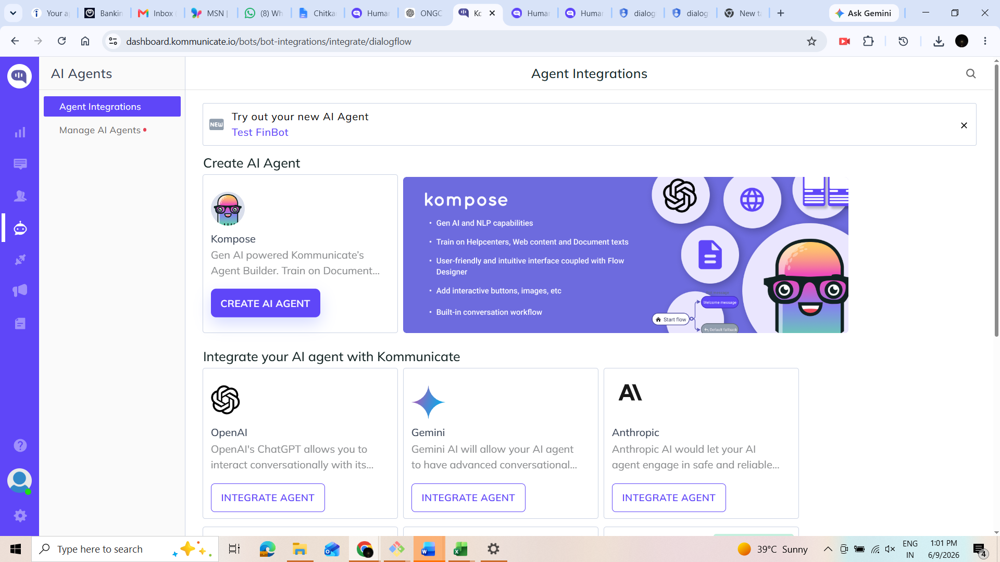

# FinBot-Kommunicate 🤖💼

FinBot is an AI-powered finance chatbot built using **Dialogflow** and **Kommunicate** to provide instant answers to financial queries such as loans, investments, insurance, and budgeting.

---

## 🌟 Key Features & Intent Visualizations

Below are the screenshots showcasing the various intents, configurations, and conversations handled by FinBot.

### 🏁 Getting Started & Integration
| Feature / Intent | Screenshot |
| --- | --- |
| **Default Welcome Intent** |  |
| **Kommunicate Integration** |  |
| **Default Fallback** |  |

### 📊 Financial Calculations & Analysis
| Feature / Intent | Screenshot |
| --- | --- |
| **EMI Calculator** |  |
| **Breakeven Intent** |  |
| **Net Present Value (NPV)** |  |
| **Current Ratio** |  |
| **Debt to Equity Ratio** |  |

### 💡 Financial Advising & Management
| Feature / Intent | Screenshot |
| --- | --- |
| **Budgeting Advice** |  |
| **Credit Score Advisor** |  |
| **Insurance Advisor** |  |
| **Chatbot Interface UI** |  |

---

## 🛠️ Tech Stack
* **Natural Language Processing (NLP):** Google Dialogflow
* **Deployment / Web Chat Widget:** Kommunicate

---

## 📜 License
This project is licensed under the MIT License - see the [LICENSE](LICENSE) file for details.
